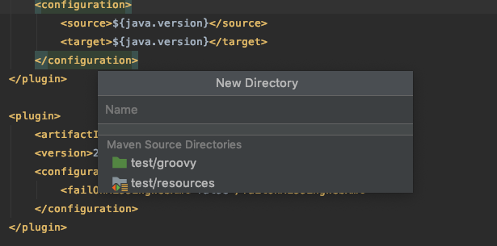
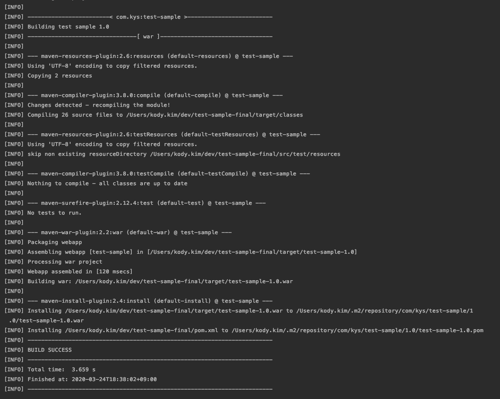
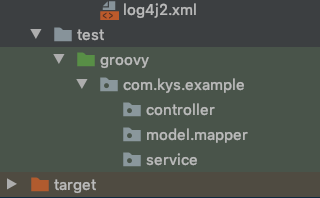
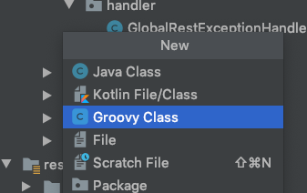
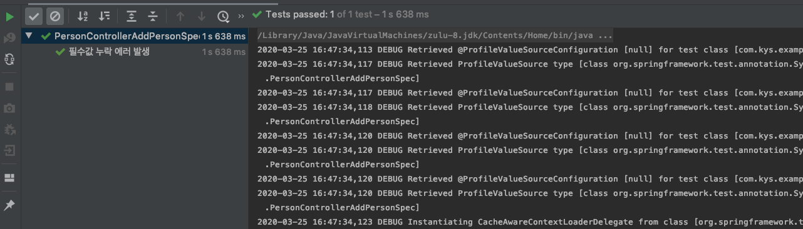
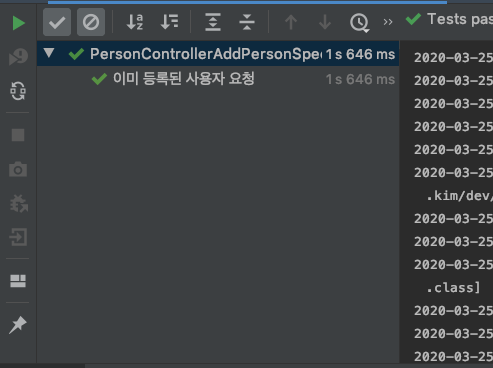
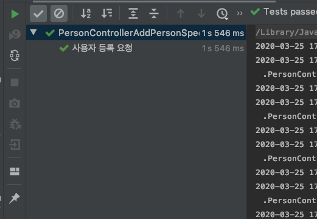
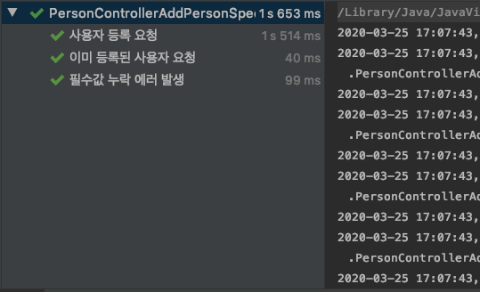
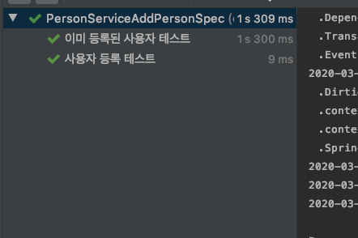
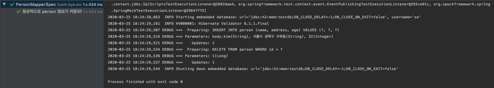

# 사내 테스트 코드 작성 발표 자료

## 1. 사전작업

* 해당 프로젝트 git clone 받기
* 로컬에 환경 설정 ( tomcat 필요함. )
* 실행 후 http://localhost:8080/person/get 호출시 응답 json 확인

## 2. 프로젝트 환경

* java8
* maven3
* spring 5.2.4.RELEASE
* mybatis 3.5.4
* h2
* lombok

# 테스트 코드 작성 환경 구축 및 코드 작성

## 1. maven 환경 설정 

### 1.1 test 소스 디렉토리 설정

일반적인 maven 프로젝트는 src/test/java를 테스트 소스 디렉토리로 사용하므로 spock 작성을 위해서 src/test/groovy를 추가합니다.

#### 1) pom.xml 에 testSourceDirectory 추가

* build 안에 아래 xml을 추가합니다.
* 추가 후 에러표시는 우선 스킵합니다.

```xml
    <testSourceDirectory>src/test/groovy</testSourceDirectory>
```

#### 2) 인텔리j에서 test folder 추가

* pom.xml 설정시 인텔리j 자동완성으로 해당 패키지 표시



* 해당 디렉토리 생성 후 pom.xml 에러 표시는 사라집니다.

### 1.2 테스트 코드용 dependency 추가

#### 1) spock repository 추가

spock을 사용하기 위한 의존성 추가 이전에 spock 라이브러리가 있는 레파지토리를 추가해야 합니다.

* project 안에 아래 xml을 추가합니다.

```xml
    <repositories>
        <repository>
            <id>spock-snapshots</id>
            <url>https://oss.sonatype.org/content/repositories/snapshots/</url>
            <snapshots>
                <enabled>true</enabled>
            </snapshots>
        </repository>
    </repositories>
```

#### 2) spock-core와 spock-spring 추가

* spring 환경에서 spock을 사용하기 위한 필수 라이브러리 입니다.

* dependency 안에 아래 xml 추가합니다.

```xml
    <dependency>
        <groupId>org.spockframework</groupId>
        <artifactId>spock-core</artifactId>
        <version>1.3-groovy-2.5</version>
        <scope>test</scope>
    </dependency>
    <dependency>
        <groupId>org.spockframework</groupId>
        <artifactId>spock-spring</artifactId>
        <version>1.3-groovy-2.5</version>
        <scope>test</scope>
    </dependency>   
```

#### 3) byteBuddy와 objenesis 추가

* spock에서 제공하는 mock을 사용하기 위한 필수 라이브러리로 별도의 mockito를 사용하지 않는다면 해당 라이브러리 의존성을 추가합니다.

```xml
    <dependency> <!-- enables mocking of classes (in addition to interfaces) -->
        <groupId>net.bytebuddy</groupId>
        <artifactId>byte-buddy</artifactId>
        <version>1.9.3</version>
        <scope>test</scope>
    </dependency>
    <dependency> <!-- enables mocking of classes without default constructor (together with CGLIB) -->
        <groupId>org.objenesis</groupId>
        <artifactId>objenesis</artifactId>
        <version>2.6</version>
        <scope>test</scope>
    </dependency>
```

#### 4) json-path 

* mvc 테스트 코드 작성시 응답 json 검증용 라이브러리 입니다.
* 현재 프로젝트에는 해당 라이브러리가 추가되어 있습니다.

```xml
<dependency>
    <groupId>com.jayway.jsonpath</groupId>
    <artifactId>json-path</artifactId>
    <version>2.4.0</version>
    <scope>test</scope>
</dependency>
```

### 1.3. maven plugin 설정 추가

maven 라이프사이클에서 `groovy를 class로 변환하는 과정`과 `변환된 class 파일을 test` 하는 plugin 설정이 필요합니다.

#### 1) gmavenplus 플러그인 추가

* groovy 를 class로 변환하는 plugin입니다.
* plugins안에 아래 xml을 추가합니다.

```xml
<!-- Mandatory plugins for using Spock -->
<plugin>
    <!-- The gmavenplus plugin is used to compile Groovy code. To learn more about this plugin,
    visit https://github.com/groovy/GMavenPlus/wiki -->
    <groupId>org.codehaus.gmavenplus</groupId>
    <artifactId>gmavenplus-plugin</artifactId>
    <version>1.8.1</version>
    <executions>
        <execution>
            <goals>
                <goal>compile</goal>
                <goal>compileTests</goal>
            </goals>
        </execution>
    </executions>
</plugin>
```

#### 2) maven surefire 플러그인 추가

* maven에서 빌드시에 작성된 테스트코드를 실행해주는 플러그인입니다.
* default로 클래스파일명에 Test가 포함되어있는 test 클래스들을 실행합니다.
* spock은 보편적으로 테스트 클래스 파일명을 Spec으로 표시하여 해당 설정을 추가합니다.

```xml
 <plugin>
    <groupId>org.apache.maven.plugins</groupId>
    <artifactId>maven-surefire-plugin</artifactId>
    <version>3.0.0-M4</version>
    <configuration>
        <includes>
            <include>**/*Test.java</include>
            <include>**/*Spec.java</include>
        </includes>
    </configuration>
</plugin>
```

### 1.4. maven clean 및 install 실행

* 작성 완료 후 pom.xml

```xml
<?xml version="1.0" encoding="UTF-8"?>
<project xmlns="http://maven.apache.org/POM/4.0.0"
         xmlns:xsi="http://www.w3.org/2001/XMLSchema-instance"
         xsi:schemaLocation="http://maven.apache.org/POM/4.0.0 http://maven.apache.org/xsd/maven-4.0.0.xsd">
    <modelVersion>4.0.0</modelVersion>

    <groupId>com.kys</groupId>
    <artifactId>test-sample</artifactId>
    <version>1.0</version>
    <packaging>war</packaging>
    <name>test sample</name>
    <description>spring mvc 환경에서 spock과 maven 을 활용한 테스트 환경 설정</description>

    <repositories>
        <repository>
            <id>spock-snapshots</id>
            <url>https://oss.sonatype.org/content/repositories/snapshots/</url>
            <snapshots>
                <enabled>true</enabled>
            </snapshots>
        </repository>
    </repositories>

    <properties>
        <project.build.sourceEncoding>UTF-8</project.build.sourceEncoding>
        <project.reporting.outputEncoding>UTF-8</project.reporting.outputEncoding>
        <java.version>1.8</java.version>
        <org.springframework.version>5.2.4.RELEASE</org.springframework.version>
        <mybatis.version>3.5.4</mybatis.version>
        <mybatis.spring.version>2.0.4</mybatis.spring.version>
    </properties>

    <dependencies>
        <!-- spring config start -->
        <dependency>
            <groupId>org.springframework</groupId>
            <artifactId>spring-context</artifactId>
            <version>${org.springframework.version}</version>
        </dependency>
        <dependency>
            <groupId>org.springframework</groupId>
            <artifactId>spring-web</artifactId>
            <version>${org.springframework.version}</version>
        </dependency>
        <dependency>
            <groupId>org.springframework</groupId>
            <artifactId>spring-webmvc</artifactId>
            <version>${org.springframework.version}</version>
        </dependency>
        <dependency>
            <groupId>org.springframework</groupId>
            <artifactId>spring-tx</artifactId>
            <version>${org.springframework.version}</version>
        </dependency>
        <dependency>
            <groupId>org.springframework</groupId>
            <artifactId>spring-aop</artifactId>
            <version>${org.springframework.version}</version>
        </dependency>
        <dependency>
            <groupId>org.springframework</groupId>
            <artifactId>spring-jdbc</artifactId>
            <version>${org.springframework.version}</version>
        </dependency>
        <dependency>
            <groupId>org.springframework</groupId>
            <artifactId>spring-core</artifactId>
            <version>${org.springframework.version}</version>
            <scope>compile</scope>
        </dependency>
        <dependency>
            <groupId>org.springframework</groupId>
            <artifactId>spring-test</artifactId>
            <version>${org.springframework.version}</version>
            <scope>test</scope>
        </dependency>
        <!-- spring config end -->

        <dependency>
            <groupId>javax.validation</groupId>
            <artifactId>validation-api</artifactId>
            <version>2.0.1.Final</version>
        </dependency>
        <dependency>
            <groupId>org.hibernate.validator</groupId>
            <artifactId>hibernate-validator</artifactId>
            <version>6.1.1.Final</version>
        </dependency>
        <dependency>
            <groupId>javax.el</groupId>
            <artifactId>javax.el-api</artifactId>
            <version>3.0.0</version>
        </dependency>
        <dependency>
            <groupId>org.glassfish</groupId>
            <artifactId>javax.el</artifactId>
            <version>3.0.0</version>
        </dependency>

        <!-- mybatis config start -->
        <dependency>
            <groupId>org.mybatis</groupId>
            <artifactId>mybatis</artifactId>
            <version>${mybatis.version}</version>
        </dependency>
        <dependency>
            <groupId>org.mybatis</groupId>
            <artifactId>mybatis-spring</artifactId>
            <version>${mybatis.spring.version}</version>
        </dependency>
        <!-- mybatis config end-->

        <!-- json config start -->
        <dependency>
            <groupId>com.fasterxml.jackson.core</groupId>
            <artifactId>jackson-core</artifactId>
            <version>2.10.3</version>
        </dependency>
        <dependency>
            <groupId>com.fasterxml.jackson.core</groupId>
            <artifactId>jackson-databind</artifactId>
            <version>2.10.3</version>
        </dependency>
        <dependency>
            <groupId>com.fasterxml.jackson.core</groupId>
            <artifactId>jackson-annotations</artifactId>
            <version>2.10.3</version>
        </dependency>
        <!-- json config end -->

        <!-- servlet config start -->
        <dependency>
            <groupId>javax.servlet</groupId>
            <artifactId>javax.servlet-api</artifactId>
            <version>3.1.0</version>
            <scope>provided</scope>
        </dependency>
        <!-- servlet config end -->

        <!-- logging config start -->
        <dependency>
            <groupId>org.slf4j</groupId>
            <artifactId>slf4j-api</artifactId>
            <version>1.7.25</version>
        </dependency>
        <dependency>
            <groupId>org.apache.logging.log4j</groupId>
            <artifactId>log4j-api</artifactId>
            <version>2.13.0</version>
        </dependency>
        <dependency>
            <groupId>org.apache.logging.log4j</groupId>
            <artifactId>log4j-core</artifactId>
            <version>2.13.0</version>
        </dependency>
        <dependency>
            <groupId>org.apache.logging.log4j</groupId>
            <artifactId>log4j-slf4j-impl</artifactId>
            <version>2.13.0</version>
        </dependency>
        <!-- logging config end -->

        <dependency>
            <groupId>com.h2database</groupId>
            <artifactId>h2</artifactId>
            <version>1.4.200</version>
        </dependency>
        <dependency>
            <groupId>org.projectlombok</groupId>
            <artifactId>lombok</artifactId>
            <version>1.18.10</version>
            <scope>provided</scope>
        </dependency>

        <dependency>
            <groupId>org.spockframework</groupId>
            <artifactId>spock-core</artifactId>
            <version>1.3-groovy-2.5</version>
            <scope>test</scope>
        </dependency>
        <dependency>
            <groupId>org.spockframework</groupId>
            <artifactId>spock-spring</artifactId>
            <version>1.3-groovy-2.5</version>
            <scope>test</scope>
        </dependency>
        <dependency> <!-- enables mocking of classes (in addition to interfaces) -->
            <groupId>net.bytebuddy</groupId>
            <artifactId>byte-buddy</artifactId>
            <version>1.9.3</version>
            <scope>test</scope>
        </dependency>
        <dependency> <!-- enables mocking of classes without default constructor (together with CGLIB) -->
            <groupId>org.objenesis</groupId>
            <artifactId>objenesis</artifactId>
            <version>2.6</version>
            <scope>test</scope>
        </dependency>

        <dependency>
            <groupId>com.jayway.jsonpath</groupId>
            <artifactId>json-path</artifactId>
            <version>2.4.0</version>
            <scope>test</scope>
        </dependency>

    </dependencies>

    <build>

        <testSourceDirectory>src/test/groovy</testSourceDirectory>

        <plugins>

            <!-- Mandatory plugins for using Spock -->
            <plugin>
                <!-- The gmavenplus plugin is used to compile Groovy code. To learn more about this plugin,
                visit https://github.com/groovy/GMavenPlus/wiki -->
                <groupId>org.codehaus.gmavenplus</groupId>
                <artifactId>gmavenplus-plugin</artifactId>
                <version>1.8.1</version>
                <executions>
                    <execution>
                        <goals>
                            <goal>compile</goal>
                            <goal>compileTests</goal>
                        </goals>
                    </execution>
                </executions>
            </plugin>

            <plugin>
                <groupId>org.apache.maven.plugins</groupId>
                <artifactId>maven-surefire-plugin</artifactId>
                <version>3.0.0-M4</version>
                <configuration>
                    <includes>
                        <include>**/*Test.java</include>
                        <include>**/*Spec.java</include>
                    </includes>
                </configuration>
            </plugin>

            <plugin>
                <groupId>org.apache.maven.plugins</groupId>
                <artifactId>maven-compiler-plugin</artifactId>
                <version>3.8.0</version>
                <configuration>
                    <source>${java.version}</source>
                    <target>${java.version}</target>
                </configuration>
            </plugin>

            <plugin>
                <artifactId>maven-war-plugin</artifactId>
                <version>2.2</version>
                <configuration>
                    <failOnMissingWebXml>false</failOnMissingWebXml>
                </configuration>
            </plugin>

        </plugins>
    </build>
</project>
```

작성된 pom.xml을 기반으로 빌드합니다.



## 2. 테스트 코드 작성용 패키지 생성

테스트 코드는 작성할 소스 코드와 동일한 패키지로 구성합니다.

* 테스트용 클래스를 import하지 않아도 바로 적용됨.

* 동일한 계층으로 구성하여 추후 클래스가 많아져도 찾아가는게 용이함.

* controller, service, mapper 레벨에 해당하는 패키지를 추가 합니다.



## 3. 테스트 코드 작성

성향의 차이일 수 있지만, 개인적으로는 메소드 별로 클래스를 생성하여 테스트 코드를 작성합니다.

실제 서비스 중인 코드 기준으로 봤을 때 하나의 service에 많은 메소드가 존재합니다.

service 기준으로 테스트코드 작성시 코드가 비대해져서 관리에 어려움을 겪을 수 있습니다. (경험담..)

### 3.1 controller 테스트 코드 작성

#### 1) config 클래스 생성

controller에서 필요한 공통적인 환경설정을 적용한 config 클래스를 생성하겠습니다.

##### 1. groovy 클래스를 선택합니다.



##### 2. PersonControllerConfig 명으로 생성.

```groovy
class PersonControllerConfig {
}
```

##### 3. 테스트용 spring 설정

```groovy
@ContextConfiguration(classes = [ MyBatisConfig.class, DataSourceConfig.class, ApplicationConfig.class, WebMvcConfig.class])
@WebAppConfiguration
@DirtiesContext(classMode = DirtiesContext.ClassMode.AFTER_CLASS)
class PersonControllerConfig {
}
```

* @ContextConfiguration(classes = [ MyBatisConfig.class, DataSourceConfig.class, ApplicationConfig.class, WebMvcConfig.class])
  * java config 파일들을 설정 합니다.
* @WebAppConfiguration
  * Controller테스트를 및 spock spring 의존성용 WebAppConfiguration을 설정 합니다.
* @DirtiesContext(classMode = DirtiesContext.ClassMode.AFTER_CLASS)
  * 로딩된 spring 클래스들을 초기화하기 위해 설정 합니다.

##### 4. Specification 상속 받기.

* Spock을 사용하기 위해 필수적으로 상속 받아야 합니다.

```groovy
@ContextConfiguration(classes = [ MyBatisConfig.class, DataSourceConfig.class, ApplicationConfig.class, WebMvcConfig.class])
@WebAppConfiguration
@DirtiesContext(classMode = DirtiesContext.ClassMode.AFTER_CLASS)
class PersonControllerConfig extends Specification {
}
```

##### 5. Controller 및 service 설정

```groovy
@ContextConfiguration(classes = [ MyBatisConfig.class, DataSourceConfig.class, ApplicationConfig.class, WebMvcConfig.class])
@WebAppConfiguration
@DirtiesContext(classMode = DirtiesContext.ClassMode.AFTER_CLASS)
class PersonControllerConfig extends Specification {

    @SpringBean 
    PersonService personService = Mock()

    @Autowired
    PersonController personController

    MockMvc mockMvc 

    def setup(){ 
        mockMvc = MockMvcBuilders.standaloneSetup(personController)
                .addFilters(new CharacterEncodingFilter("UTF-8", true))
                .setValidator(new LocalValidatorFactoryBean())
                .setControllerAdvice(new GlobalRestExceptionHandler())
                .build()
    }
}
```

* @SpringBean은 mock 객체를 SpringBean으로 등록시켜 줍니다.
* MockMvc에 등록할 Controller를 의존성 주입 받습니다.
* MockMvc 내부에는 DispatcherServlet 를 상속받은 TestDispatcherServlet 를 사용합니다.

#### 2) 사용자 추가 테스트 코드 작성

##### 1. PersonControllerAddPersonSpec 으로 groovy 클래스 생성

```groovy
class PersonControllerAddPersonSpec{
}
```

##### 2. PersonControllerConfig 상속

```groovy
class PersonControllerAddPersonSpec extends PersonControllerConfig{

}
```

##### 3. @Narrative 설정

* spcok의 확장 어노테이션 중에 하나로 해당 테스트 스펙의 설명을 작성할 수 있습니다.

```groovy
@Narrative( value = """
    Person 사용자 등록 테스트 진행
"""
)
class PersonControllerAddPersonSpec extends PersonControllerConfig{
}
```

##### 4. 필수값 에러 테스트 코드 작성

```groovy
    def "필수값 누락 에러 발생 "(){

        given:
        def param = MockMvcRequestBuilders.post("/person")
                .param("name", name)
                .param("address", address)
                .param("age", age)

        when:
        def resultAction = mockMvc.perform(param)
                .andDo(print())

        then:
        resultAction.andExpect(status().is4xxClientError())
        resultAction.andExpect(jsonPath('$.code').value(ErrorCode.CD_0001.getCode()))
        resultAction.andExpect(jsonPath('$.message').value(message))
        resultAction.andExpect(jsonPath('$.data').doesNotExist())

        where:
        name     | address           | age  || message
        ""       | "서울시 강북구 수유동"  | "32" || "name 은 필수 입니다."
        "김용성"   | ""                | "32" || "address 는 필수 입니다."
        "김용성"   | "서울시 강북구 수유동"  | ""   || "age 는 필수 값 입니다."
        "김용성"   | "서울시 강북구 수유동"  | "0"  || "age 는 0보다 커야 합니다."

    }
```

* where 를 사용하여 하나의 메소드로 필수 값 별로 테스트 코드 작성이 가능합니다.
  * junit을 사용하여 동일한 항목을 체크하는 메소드를 작성하는 경우를 생각해보면 훨씬 심플하게 작성이 가능합니다.
* 해당 메소드 블럭안에 문자열 커서를 이동 후 단축키 control + shift + R 입력합니다.
* 필수값 에러 테스트 코드 실행 결과 화면 입니다.



##### 5. 이미 등록된 사용자 요청 테스트 코드 작성

```groovy
    def "이미 등록된 사용자 요청"(){

        given:
        personService.addPerson(_) >> { throw new AlreadyPersonException() }

        def param = MockMvcRequestBuilders.post("/person")
                .param("name", "kody.kim")
                .param("address", "서울시 강북구 수유동")
                .param("age", "32")

        when:
        def resultAction = mockMvc.perform(param)
                .andDo(print())

        then:
        resultAction.andExpect(status().isBadRequest())
        resultAction.andExpect(jsonPath('$.code').value(ErrorCode.CD_1002.getCode()))
        resultAction.andExpect(jsonPath('$.message').value(ErrorCode.CD_1002.getMessage()))
        resultAction.andExpect(jsonPath('$.data').doesNotExist())
    }
```

* given 블록에서 addPerson 호출시 예외 발생하도록 선언합니다.
* 해당 메소드 블럭안에 문자열 커서를 이동 후 단축키 control + shift + R 입력합니다.
* 이미 등록된 사용자 요청 테스트 코드 실행 결과 화면 입니다.



##### 6. 사용자 등록 요청 테스트 코드 작성

```groovy
    def "사용자 등록 요청"(){

        given:
        personService.addPerson(_) >> DataResponse.ok(1l)

        def param = MockMvcRequestBuilders.post("/person")
                .param("name", "kody.kim")
                .param("address", "서울시 강북구 수유동")
                .param("age", "32")

        when:
        def resultAction = mockMvc.perform(param)
                .andDo(print())
        then:
        resultAction.andExpect(status().isOk())
        resultAction.andExpect(jsonPath('$.code').value(ErrorCode.CD_0000.getCode()))
        resultAction.andExpect(jsonPath('$.message').value(ErrorCode.CD_0000.getMessage()))
        resultAction.andExpect(jsonPath('$.data').isNumber())

    }
```

* given 블록에서 addPerson 호출시 성공 응답을 리턴하도록 선언합니다.
* 해당 메소드 블럭안에 문자열 커서를 이동 후 단축키 control + shift + R 입력합니다.
* 사용자 등록 요청 테스트 코드 작성 실행 결과 화면 입니다.



##### 7. PersonControllerAddPersonSpec 테스트 실행

클래스 블럭 안에 문자열 커서를 이동 후 control + shift + R 입력합니다.

* PersonControllerAddPersonSpec 테스트 코드 실행 결과 화면 입니다.



### 3.2 Service 테스트 코드 작성

Controller와 마찬가지로 Service도 공통적인 환경설정을 적용한 config 클래스를 생성하겠습니다.

#### 1) PersonServiceConfig 생성

##### 1. groovy 클래스를 선택합니다.


##### 2. PersonServiceConfig 명으로 생성.

```groovy
class PersonServiceConfig {
}
```

##### 3. 테스트용 spring 설정

```groovy
@ContextConfiguration(classes = [ MyBatisConfig.class, DataSourceConfig.class, ApplicationConfig.class, WebMvcConfig.class])
@WebAppConfiguration
@DirtiesContext(classMode = DirtiesContext.ClassMode.AFTER_CLASS)
class PersonServiceConfig {
}
```

##### 4. Specification 상속 받기.

* Spock을 사용하기 위해 필수적으로 상속 받아야 합니다.

```groovy
@ContextConfiguration(classes = [ MyBatisConfig.class, DataSourceConfig.class, ApplicationConfig.class, WebMvcConfig.class])
@WebAppConfiguration
@DirtiesContext(classMode = DirtiesContext.ClassMode.AFTER_CLASS)
class PersonServiceConfig extends Specification{
}
```

##### 5. Service 및 Mapper 설정

```groovy
@ContextConfiguration(classes = [ MyBatisConfig.class, DataSourceConfig.class, ApplicationConfig.class, WebMvcConfig.class])
@WebAppConfiguration
@DirtiesContext(classMode = DirtiesContext.ClassMode.AFTER_CLASS)
class PersonServiceConfig extends Specification{

    @SpringBean
    PersonMapper personMapper = Mock()

    @Autowired
    PersonService personService
}
```

* PersonMapper mock객체를 springBean으로 등록합니다.
* personService를 테스트 하기 위해 bean을 주입받습니다.

#### 2) 사용자 추가 테스트 코드 작성

##### 1. PersonServiceAddPersonSpec 으로 groovy 클래스 생성

```groovy
class PersonServiceAddPersonSpec{
}
```

##### 2. PersonServiceConfig 상속

```groovy
class PersonControllerAddPersonSpec extends PersonControllerConfig{

}
```

##### 3. @Narrative 설정

```groovy
@Narrative( value = """
    사용자 추가 테스트 
"""
)
class PersonServiceAddPersonSpec extends PersonServiceConfig{
}
```

##### 4. 이미 등록된 사용자 테스트 코드 작성

```groovy
    def "이미 등록된 사용자 테스트"(){

        given: "특정 name으로 조회 요청시 동일한 name 의 사용자 정보를 리턴하겠다."
        personMapper.findByName(name) >> Optional.of(new Person(1l, name, address, age))

        when: "사용자 등록 요청"
        personService.addPerson(new PersonRegDTO(name, address, age))

        then: "예외 발생 검증"
        def ex = thrown(exception)
        ex.message == _message

        where:
        name         | address           | age || exception                    | _message
        "kody.kim"   | "서울시 강북구 수유동" | 32   || AlreadyPersonException.class | ErrorCode.CD_1002.getMessage()
    }
```

* addPerson 내부에서 동일한 이름으로 등록된 사용자가 있는 경우 AlreadyPersonException 이 발생합니다.
* given 블럭에서 특정 이름으로 조회시 사용자 정보가 조회되도록 설정합니다.
* then 블럭에서 AlreadyPersonException 이 발생했는지 확인하고 메시지를 검증합니다.

##### 5. 사용자 등록 테스트 코드 작성

```groovy
    def "사용자 등록 테스트"(){

        given: "특정 name 으로 조회 요청시 null을 리턴하겠다."
        personMapper.findByName(name) >> Optional.empty()

        when: "사용자 등록 요청"
        Response response = personService.addPerson(new PersonRegDTO(name, address, age))

        then: "처리 결과 검증"
        Objects.nonNull(response)
        response.getCode() == ErrorCode.CD_0000.getCode()
        response.getMessage() == ErrorCode.CD_0000.getMessage()
        1 * personMapper.insert(_)

        where:
        name         | address           | age
        "kody.kim"   | "서울시 강북구 수유동" | 32
    }
```

* given 블럭에서 특정 이름으로 조회시 사용자 정보가 없도록 설정합니다.
* addPerson 내부에서 사용자가 없을 경우 personMapper.insert 를 호출하는데, then 블럭에서 해당 메소드 호출 여부를 검증합니다.

##### 6. PersonServiceAddPersonSpec 테스트 실행

* 단축키 control + shift + R 을 입력하여 테스트 실행합니다.



### 3.3 Mapper 테스트 코드 작성

Mapper의 경우 실질적으로 데이터베이스와 통신하는 인프라스트럭처 계층을 담당하고 있습니다. controller, service와 달리 쿼리 정상 호출 여부만 검증하므로 mapper에만 작성하겠습니다.

#### 1) PersonMapper 테스트 코드 작성

##### 1. PersonMapperSpec groovy 클래스 생성

```groovy
class PersonMapperSpec {
}
```

##### 2. 테스트용 spring 설정

```groovy
@ContextConfiguration(classes = [ MyBatisConfig.class, DataSourceConfig.class, ApplicationConfig.class, WebMvcConfig.class])
@WebAppConfiguration
@DirtiesContext(classMode = DirtiesContext.ClassMode.AFTER_CLASS)
class PersonMapperSpec{
}
```

##### 3. Specification 상속 받기

```groovy
@ContextConfiguration(classes = [ MyBatisConfig.class, DataSourceConfig.class, ApplicationConfig.class, WebMvcConfig.class])
@WebAppConfiguration
@DirtiesContext(classMode = DirtiesContext.ClassMode.AFTER_CLASS)
class PersonMapperSpec extends Specification{
}
```

##### 4. PersonMapper 의존성 주입

```groovy
@ContextConfiguration(classes = [ MyBatisConfig.class, DataSourceConfig.class, ApplicationConfig.class, WebMvcConfig.class])
@WebAppConfiguration
@DirtiesContext(classMode = DirtiesContext.ClassMode.AFTER_CLASS)
class PersonMapperSpec extends Specification{

    @Autowired
    private PersonMapper mapper
}
```

##### 5. insert 메소드 테스트 코드 작성

```groovy
    def "정상적으로 person 정보가 저장되어야 한다."(){

        given: "고객 정보 설정"
        def person = new Person(null, "kody.kim", "서울시 강북구 수유동", 32)

        when: "저장 호출"
        mapper.insert(person)

        then: "id 값이 정상적으로 설정되었는지 확인"
        Objects.nonNull(person.getId())
        person.getId() > 0l

        cleanup: "고객정보 삭제"
        mapper.delete(person)

    }
```
* 테스트 결과 화면



## 4. 마치며

지금까지 controller, servcie, mapper 에서 메소드 하나씩 테스트를 작성해보았습니다. 미작성된 메소드들은 연습겸 테스트 코드를 작성해보면 좋을 것 같습니다.

모든 메소드별로 작성된 테스트 코드는 별도의 프로젝트로 구성하여 [github](https://github.com/KimYongSung/test-sample-finish.git) 에 올려두었습니다. 